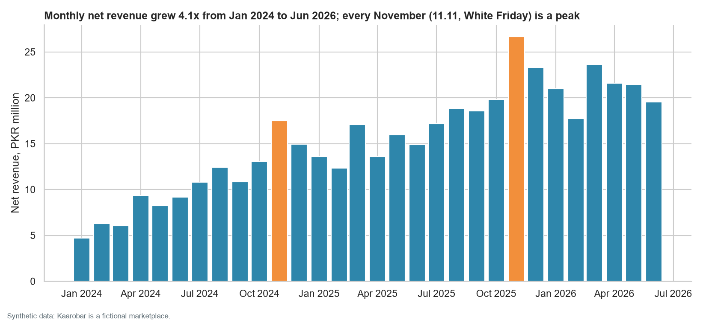
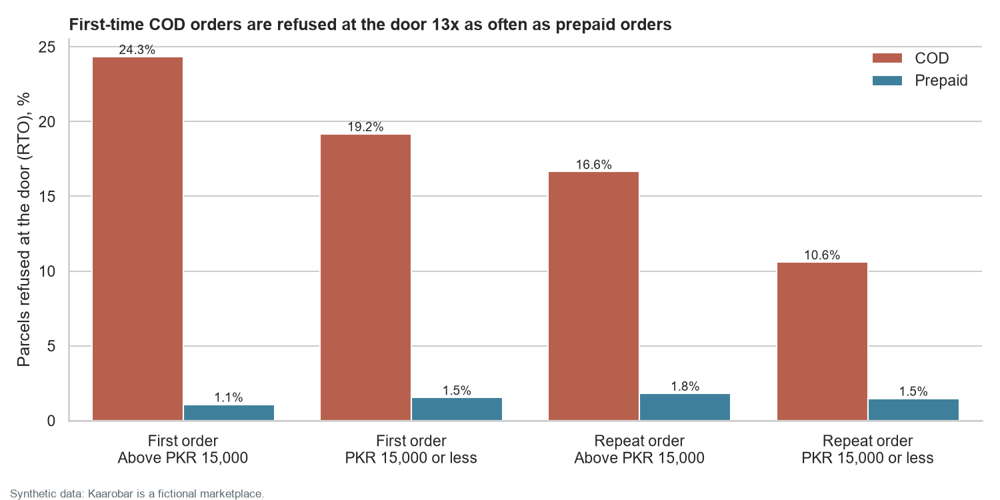
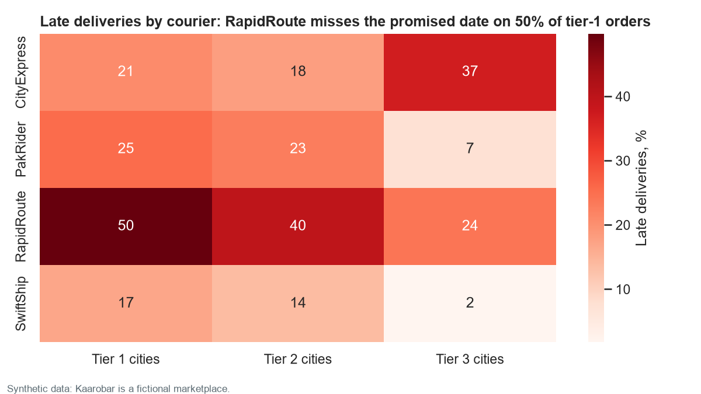
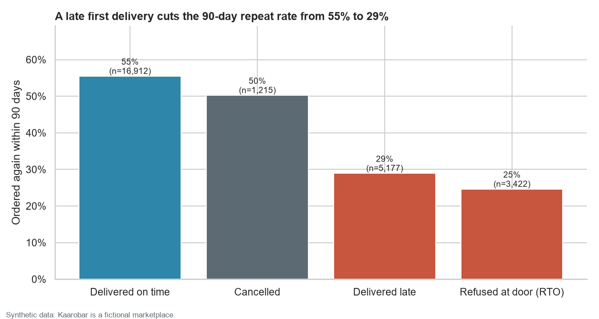
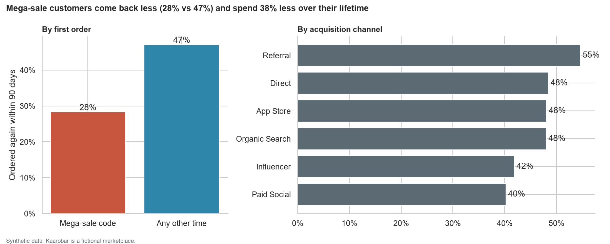
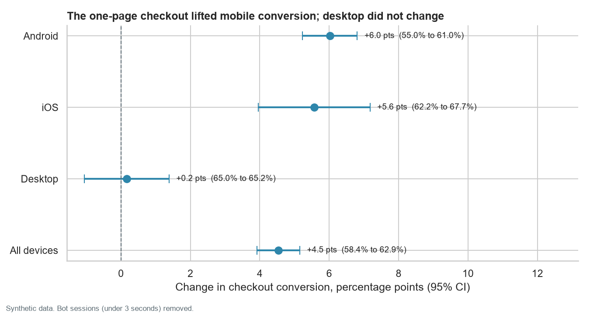
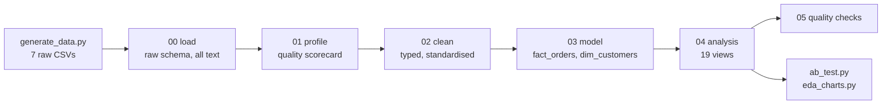

# Kaarobar Marketplace Analytics

**End-to-end analysis of a Pakistani e-commerce marketplace: 68,000 orders, 36,000 customers, and a checkout A/B test, from messy raw extracts to business recommendations.**

SQL (PostgreSQL syntax, run on DuckDB) · Python (pandas, Matplotlib, Seaborn) · Statistics (A/B testing, cohort analysis, RFM segmentation)

> **About the data.** Kaarobar is a fictional company and every row is synthetic, generated by [`src/generate_data.py`](src/generate_data.py). The generator was designed to behave like a real marketplace, with realistic problems to clean and realistic patterns to find. The findings below describe this synthetic data. They are not claims about the Pakistani market.



## The business problem
Kaarobar sells fashion, electronics, home goods, beauty, and grocery products in 16 Pakistani cities. It has grown quickly since January 2024, but leadership keeps raising three worries: parcels refused at the door, late deliveries after big sales, and customers who buy once and never return. The product team also needs a decision on a new one-page checkout.

The full requirements, stakeholders, and metric definitions are in the [project brief](docs/project_brief.md).

## Key findings

**1. Growth is strong but spiky.** Monthly net revenue grew 4.1x between January 2024 and June 2026. The 11.11 sale on 11 November 2025 brought 755 orders, about 11 times a normal day.

**2. Cash on delivery is shrinking but still drives refused parcels.** Cash on delivery (COD) fell from 78% to 53% of monthly orders as mobile wallets rose from 7% to 31%. Yet a first-time COD order is refused at the door about 13 times as often as a prepaid order: 24% of first-time COD orders above PKR 15,000 come back, against under 2% of prepaid orders. In 2025, refused COD parcels carried PKR 26.1 million of sales and cost about PKR 1.1 million in courier and handling fees (at an assumed PKR 420 per parcel).



**3. One courier is late on half its big-city deliveries.** RapidRoute misses the promised date on 50% of tier-1 deliveries, and CityExpress on 37% of tier-3 deliveries, while SwiftShip stays below 17% everywhere. Operations moved volume to RapidRoute in July 2025 (its share rose from 17% to 29%). After every mega sale, late deliveries spike; 58% of November 2025 deliveries were late.



**4. The first order decides whether a customer returns.** When the first order arrives on time, 55% of customers order again within 90 days. When it arrives late, only 29% do; when it is refused at the door, 25%.



**5. Customers won in mega sales are worth less.** Customers whose first order used a mega-sale code came back within 90 days 28% of the time, against 47% for everyone else, and brought 38% less net revenue over their lifetime. By channel, referrals retain best (55%) and paid social worst (40%).



**6. Fashion returns are a sizing problem, and five sellers stand out.** Fashion has the highest return rate (15%), and 48% of those returns cite size or fit. A binomial z-test flags five sellers whose return rates are 1.6 to 2.8 times their category average, mostly for items "not as described".

**7. A third of revenue sits with customers who have gone quiet.** RFM segmentation puts 6,365 customers in "At risk": they bought often but have not ordered in a long time. Together they account for 34% of net revenue, the largest share of any segment.

**8. The one-page checkout works on mobile, not on desktop.** Conversion rose from 58.4% to 62.9% overall (+4.5 points, p < 0.001): +6.0 points on Android and +5.6 on iOS, but +0.2 on desktop (p = 0.79, no real change). Bot sessions leaned toward the treatment group; left in, they would have understated the lift at 3.9 points.



**9. Smaller cities are the growth frontier.** Tier-3 cities grew from 13% to 17% of orders between the first half of 2024 and the first half of 2026, and still pay cash on delivery most often (69%, against 48% in the largest cities).

More charts: [daily seasonality](images/02_daily_orders.png), [payment mix](images/03_payment_mix.png), [late deliveries by month](images/06_late_deliveries_by_month.png), [cohort retention](images/08_cohort_retention.png), [returns by category](images/10_returns_by_category.png), [RFM segments](images/12_rfm_segments.png), [city tiers](images/13_city_tier_growth.png).

## Recommendations
1. **Roll out the one-page checkout on Android and iOS now.** Keep the current desktop checkout and test a different change there.
2. **Target COD refusals where they concentrate.** For first-time COD orders above PKR 15,000, test an order confirmation by SMS or a small advance payment, and test a prepaid discount. Measure the RTO rate against a control group.
3. **Rebalance couriers.** Move tier-1 volume from RapidRoute to SwiftShip, take CityExpress out of tier-3 cities, and agree extra capacity with couriers before November.
4. **Protect the first order.** Send first-time customers' orders with the fastest courier for their city, since a late first delivery halves the chance of a second order.
5. **Rethink sale-driven acquisition.** Shift budget from paid social toward referrals, and follow up with customers acquired in a sale within weeks of their first order.
6. **Fix fashion sizing and review five sellers.** Add size guides to fashion and footwear listings, and review the five flagged sellers' listings.
7. **Win back the "At risk" segment** with a targeted campaign, starting with the highest spenders.

## How the data was cleaned
The raw extracts arrive as text with the problems a real export has. [`sql/01_profile_raw.sql`](sql/01_profile_raw.sql) measures each problem before anything changes, and [`sql/02_clean.sql`](sql/02_clean.sql) fixes it:

| Problem found | Rows | Fix |
|---|---:|---|
| Order system migrated on 2025-01-01: dates switched from `DD/MM/YYYY HH:MI` to ISO | 18,203 | Parse each format with portable string functions |
| 16 cities spelled 59 ways (`KHI`, `lahore`, `Pindi`, `Abbotabad`) | 6,231 | Lookup table from lower-cased spelling to city, province, and tier |
| 10 payment labels and 9 status labels across the two systems | all | Mapped to 3 payment methods and 4 statuses |
| Exact duplicate order rows from an ingestion retry | 272 | Removed |
| Duplicate customer accounts (same email, different case or spaces) | 540 | Merged into the earliest account; 282 orders re-attributed |
| Blank shipping city | 546 | Filled from the customer's home city |
| Prices with an extra zero typed in (10x or 100x the list price) | 266 | Divided back and flagged |
| Zero or negative quantities | 106 | Dropped |
| Delivery timestamp earlier than the order | 58 | Set to unknown and flagged |
| QA test accounts and orders | 45 orders | Excluded everywhere |
| Orphan returns pointing at items that do not exist | 14 | Dropped |
| Duplicate and bot checkout sessions (under 3 seconds) | 492 and 1,261 | Duplicates removed; bots flagged and excluded from the A/B test |

[`sql/05_quality_checks.sql`](sql/05_quality_checks.sql) then runs 16 tests on the cleaned data (unique ids, every label mapped, no delivery before order, prices never above list price, and more). All pass. Two warnings are reported and left as they are: 3 orders with no known city, and 522 delivered orders with no delivery time.

## Pipeline



Three layers keep each step honest: `raw` holds the extracts untouched, `clean` holds typed and standardised tables, and `mart` holds the analysis tables and one view per business question.

## The data

| Table | Rows | What it holds |
|---|---:|---|
| customers | 36,543 | Accounts, signup date, city, acquisition channel, device |
| sellers | 137 | Marketplace sellers |
| products | 637 | Catalog across 8 categories, with list price and cost |
| orders | 68,155 | Orders from January 2024 to June 2026, with payment, courier, and delivery dates |
| order_items | 106,765 | Order lines with charged price and discount |
| returns | 7,071 | Returned items, reasons, and refunds |
| checkout_sessions | 98,799 | Sessions from the checkout A/B test, March to April 2026 |

Column-level detail and every known problem are in the [data dictionary](docs/data_dictionary.md). The first 1,000 rows of each table are in [`data/sample/`](data/sample/).

## How to run
Requires Python 3.11 or later. Run from the project root:

```bash
python -m pip install -r requirements.txt
python src/generate_data.py   # about 40 seconds; writes data/raw/
python src/run_pipeline.py    # SQL: load, profile, clean, model, analyse, test
python src/ab_test.py         # A/B test statistics and chart
python src/eda_charts.py      # charts to images/
```

The data is seeded, so every run reproduces the same numbers. Query results land in `outputs/` as CSV.

The SQL is written in PostgreSQL syntax and tested end to end on DuckDB, which needs no database server. To load into PostgreSQL instead, run `sql/00_load_postgres.sql` with `psql`, then files 01 to 05 in order.

## Repository structure
```
├── data/sample/          first 1,000 rows of each raw table
├── docs/
│   ├── project_brief.md   stakeholders, questions, metric definitions
│   └── data_dictionary.md tables, columns, and known data problems
├── images/               charts used in this README
├── outputs/              query results as CSV
├── sql/
│   ├── 00_load_duckdb.sql / 00_load_postgres.sql
│   ├── 01_profile_raw.sql
│   ├── 02_clean.sql
│   ├── 03_model.sql
│   ├── 04_analysis.sql
│   └── 05_quality_checks.sql
└── src/
    ├── generate_data.py   synthetic data generator
    ├── run_pipeline.py    runs the SQL and exports results
    ├── ab_test.py         significance tests and sample ratio check
    └── eda_charts.py      exploratory charts
```

## Techniques used
- **SQL:** CTEs, window functions (`ROW_NUMBER`, `LAG`, `NTILE`, `SUM() OVER`), filtered aggregates, lookup-table standardisation, regex cleaning, deduplication, data quality tests
- **Data modelling:** raw, clean, and mart layers; a fact table and a customer dimension
- **Analysis:** cohort retention, RFM segmentation, funnel conversion, return-rate outlier detection
- **Statistics:** two-proportion z-test with confidence intervals, chi-square sample ratio check, one-sided binomial z-test
- **Python:** pandas, Matplotlib, Seaborn, DuckDB

## Limitations
- The data is synthetic. The patterns were designed into the generator, so the analysis shows the method working, not facts about a real business.
- The retention findings are associations. A real business would test whether faster first deliveries cause more repeat orders, for example with a courier routing experiment.
- RFM scores use quintiles; many customers share the same order count, so the frequency score splits ties arbitrarily.
- Courier prices are not in the data, so the courier recommendation weighs service quality only.

## Next steps
- A Power BI dashboard on the `mart` tables for a weekly operations review.
- A cost model comparing courier prices with the cost of late deliveries and refused parcels.

---
Abdul Samee · [LinkedIn](https://www.linkedin.com/in/abdulsamee-)
